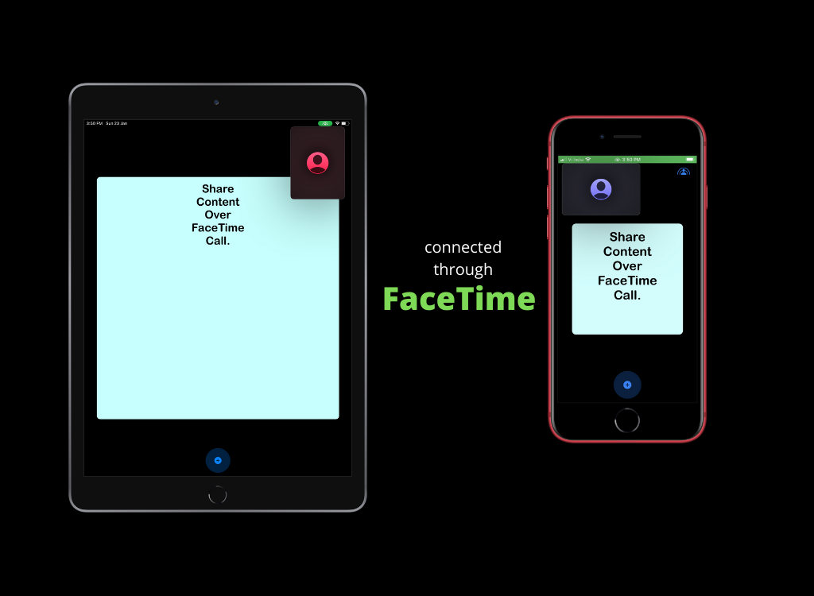

# SharePlay-TextEditor
An **iOS & iPadOS** application, by which people can **write/edit texts and change font-styles/background color** over **FaceTime** call.
 
*(experimenting with SharePlay)*
 
 
The app uses **FaceTime SharePlay** and **GroupActivities API**, recently announced at **WWDC21**.
 
SharePlay gives users the ability to share experiences right inside FaceTime. And with the Group Activities API, brings shared media from the app into a space where people are already connecting with each other.
 
 

